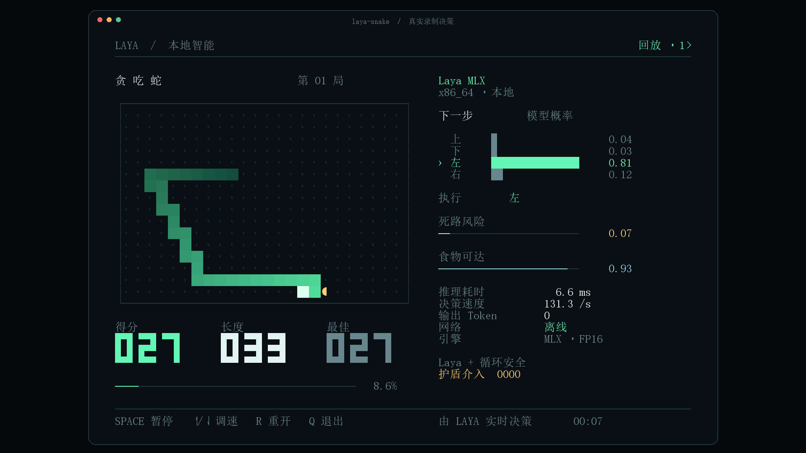

# Laya-MLX · 中文界面 + NVIDIA 实测



> 本仓库是 [mizorewww/laya-mlx](https://github.com/mizorewww/laya-mlx) 的 fork。
> 上游是面向 **Apple Silicon** 的 MLX 原生移植；本 fork 增加两件事：
>
> 1. **终端界面汉化** —— `laya-snake` 界面全部改为简体中文
> 2. **Windows + NVIDIA 完整实测** —— 借助 MLX 官方 CUDA 后端，在 WSL2 + RTX 3060 Ti 上
>    跑通 Python API、命令行与贪吃蛇 Demo，并记录可复现数据
>
> MLX 官方**只支持 Apple Silicon**（上游 `pyproject.toml` 中 `mlx` 依赖带
> `sys_platform == 'darwin' and platform_machine == 'arm64'` 标记）。
> 本仓库的 Windows 路径使用 MLX 的 **CUDA 后端**，属于非官方支持组合，但已在本机逐项验证。
> 需要 macOS 原生路径请以上游仓库为准。

**开放权重的结构化决策模型，本地推理，0 个输出 token。**

Laya 不做文本生成，而是在一次双向前向中直接给出决策分布：分类选项的概率、评分量表的期望分、
命题为真的概率。没有逐 token 解码，没有云端 API。

## 本机实测

测试环境：

| 项目 | 值 |
| --- | --- |
| 宿主系统 | Windows 11（x64） |
| 显卡 | NVIDIA GeForce RTX 3060 Ti · sm_86 · 8 GB · 驱动 591.86 |
| 运行环境 | WSL2 · Ubuntu 24.04 · kernel 6.18 · glibc 2.39 |
| Python | 3.12.3 |
| MLX | `mlx 0.32.2` + `mlx-cuda-12 0.32.2` |
| 精度 | FP16 |

端到端延迟与吞吐。计时口径与上游一致：包含提示准备、tokenization、张量构建、GPU 同步推理、
校准与结果格式化，**不含**模型加载。单问题数据为 150 次采样。

| FP16，端到端 | Laya 421M（英文短问题） | Multilingual 322M（中文短问题） |
| --- | ---: | ---: |
| 单个短问题 P50 | 14.61 ms | **9.26 ms** |
| 单个短问题 P95 | 16.70 ms | 10.73 ms |
| 单个短问题 P99 | 18.46 ms | 12.41 ms |
| 最快 / 最慢 | 13.74 / 19.80 ms | 8.15 / 12.65 ms |
| 50 问题吞吐量 | 354.4 q/s | **787.4 q/s** |
| 单问题峰值显存 | 1031.4 MiB | 709.1 MiB |
| 50 问题批量峰值显存 | 2359.1 MiB | 2193.5 MiB |
| 模型加载（权重已缓存） | 1.22 s | 1.75 s |

50 问题吞吐量与上游口径一致：单次调用提交 50 个问题，`batch_size=64`（API 默认 16）。

### 与上游 M3 Max 对比

上游公布的是 M3 Max（40 核 GPU、128 GiB 统一内存）数据：

| 指标 | M3 Max（上游公布） | RTX 3060 Ti（本机实测） |
| --- | ---: | ---: |
| Laya 421M 单问题 P50 | 13.42 ms | 14.61 ms |
| Multilingual 单问题 P50 | 7.39 ms | 9.26 ms |
| Laya 421M 50 问题吞吐 | 146.8 q/s | 354.4 q/s |
| Multilingual 50 问题吞吐 | 395.0 q/s | 787.4 q/s |
| Laya 421M 单问题峰值 | 943.6 MiB | 1031.4 MiB |
| Multilingual 单问题峰值 | 687.6 MiB | 709.1 MiB |

单问题延迟比 M3 Max 慢约 1–2 ms，批量吞吐约为其 **2 倍**，显存占用接近。
这与 CUDA 后端在大 batch 下的并行特性有关；两个平台使用不同的 MLX 后端，
数字只代表各自机器，请勿跨平台外推。

### 贪吃蛇（900 步，`--max-speed`）

```json
{ "steps": 900, "inference_calls": 900, "seconds": 7.33,
  "steps_per_second": 122.7, "mean_inference_ms": 7.77,
  "score": 27, "length": 33, "interventions": 0, "deaths": 0,
  "guarded": true, "network": "offline" }
```

每一步都是一次真实的 Laya 推理。900 步内安全护盾**一次都没有介入**，
即 Laya 的原始决策本身全程安全。上面的界面图就是这个录制中的真实一帧。

## Windows / WSL2 安装

Windows 上无法原生运行：MLX 没有 Windows wheel。可行路径是 **WSL2 + NVIDIA GPU**。
前置条件：WSL 发行版 glibc ≥ 2.35、NVIDIA 驱动 ≥ 550.54.14、显卡算力 ≥ SM 7.5。

```bash
# 1. 在 WSL 内准备环境（不要用 Windows 侧的 Python）
curl -LsSf https://astral.sh/uv/install.sh | sh
export PATH="$HOME/.local/bin:$PATH"
uv venv ~/laya-mlx-venv --python 3.12
source ~/laya-mlx-venv/bin/activate

# 2. 安装 MLX 的 CUDA 后端（会拉取约 2 GB 的 CUDA 运行库）
uv pip install 'mlx[cuda12]'

# 3. 关键一步：补上 CUDA 头文件包
uv pip install nvidia-cuda-runtime-cu12

# 4. 安装本仓库
uv pip install -e .

# 5. 自检：应当输出 Device(gpu, 0) 与 True
python -c "import mlx.core as mx; print(mx.default_device(), mx.cuda.is_available())"
```

### 两个必踩的坑

**坑 1：`Can not find locations of CUDA headers`**

`mlx[cuda12]` 只装 CUDA **运行库**，不含头文件。而 MLX 的 CUDA 后端用 NVRTC 在运行时
JIT 编译 kernel，会按固定路径查找头文件（见 MLX 源码 `mlx/backend/cuda/jit_module.cpp`）：

```
<site-packages>/nvidia/cuda_runtime/include
```

找不到才会回退 `CUDA_HOME` / `CUDA_PATH`，再找不到就报错。这个错误**只在第一次前向计算时出现**，
模型加载阶段完全正常，很容易误判成模型问题。上面第 3 步的
`nvidia-cuda-runtime-cu12` 就是补这个包 —— 不需要系统安装 CUDA Toolkit，`nvcc` 也不是必需的。

**坑 2：`IncompleteSnapshotError`**

`huggingface-hub` 1.x 会校验快照完整性。如果当初只下载了模型必需文件，缺少
`.gitattributes`、`LICENSE`、`NOTICE` 等，`snapshot_download(local_files_only=True)`
会直接判定快照不完整（贪吃蛇 Demo 强制离线加载，因此必然触发）。完整下载一次即可：

```bash
hf download aac6fef/laya-multilingual-mlx
```

## 中文界面

上游终端界面为英文。本 fork 已把 `laya_mlx/snake/ui.py` 与 `replay.py` 汉化：

| 上游 | 本仓库 |
| --- | --- |
| LAYA / LOCAL INTELLIGENCE | LAYA / 本地智能 |
| SNAKE · ROUND 12 | 贪 吃 蛇 · 第 12 局 |
| NEXT MOVE / MODEL PROBABILITIES | 下一步 / 模型概率 |
| UP / DOWN / LEFT / RIGHT | 上 / 下 / 左 / 右 |
| EXECUTING | 执行 |
| DEAD-END RISK / FOOD REACHABLE | 死路风险 / 食物可达 |
| INFERENCE / DECISIONS | 推理耗时 / 决策速度 |
| OUTPUT TOKENS / NETWORK / ENGINE | 输出 Token / 网络 / 引擎 |
| OFFLINE | 离线 |
| Shield interventions | 护盾介入 |
| SCORE / LENGTH / BEST | 得分 / 长度 / 最佳 |
| SPACE pause ↑/↓ speed R reset Q quit | SPACE 暂停 ↑/↓ 调速 R 重开 Q 退出 |
| ESTIMATES BY LAYA | 由 LAYA 实时决策 |

### 实现要点：画布改为「宽度感知」

中文在终端占 **2 列**，而原 `Canvas` 按**字符**排版，直接替换文案会让右侧面板整体错位。
因此画布改为按**显示列**推进：

- 新增 `char_width()` / `display_width()` / `pad()`；CJK、全角与 emoji 计 2 列，
  制表符与方块字符计 1 列
- `put()` 按字符显示宽度推进列号；宽字符的尾格写入空串 `""`，拼接时不产生任何字符，
  于是**列表索引恒等于显示列**
- 右对齐由 `len(state)` 改为 `display_width(state)`

`replay.py`（PNG / MP4 导出）有同一个问题：`glyph()` 原本把每个字画进 1 格宽的画布，
中文会被裁掉右半边。现已按 `char_width` 分配 2 列宽度。

终端需使用含中日韩字形的字体。Windows Terminal 默认字体不含中文，通常会自动回退；
若显示为方块或出现轻微错位，请在设置里换成等宽中文字体（如「更纱黑体 Mono SC」）。

## 运行贪吃蛇

```bash
pip install 'laya-mlx[demo]'
hf download aac6fef/laya-multilingual-mlx   # 提前下载，之后完全离线
laya-snake
```

终端至少需要 **104 列 × 35 行**；空间不足时程序会提示并等待，放大窗口即可继续。
空格暂停、↑/↓ 调速、R 重开、Q 退出。

```bash
laya-snake --max-speed --optimize    # 满速 + 编译 + 前缀复用
laya-snake --unassisted              # 关闭安全护盾，执行原始 top-1
laya-snake --headless --steps 900    # 无终端环境，结束时打印统计 JSON
laya-snake export run.jsonl --output frame.png --font /path/to/cjk.ttf
```

加 `--record run.jsonl` 会记录每一步的真实决策与棋盘；`export` 可把录制渲染成 PNG 或 MP4，
用于复现和留证。

## Python API

```python
import laya_mlx as laya

agent = laya.load("aac6fef/laya-multilingual-mlx")   # 默认 FP16
result = agent.predict(
    "发票被重复扣款了，请把多收的那笔退给我，今天必须处理。",
    {
        "department": {
            "type": "choice",
            "instructions": "这条咨询应该由哪个部门处理？",
            "criteria": {
                "billing": "发票、付款、退款",
                "technical": "故障、报错、系统异常",
                "sales": "价格、新合同",
                "other": "其他所有情况",
            },
        },
        "urgency": {
            "type": "score",
            "instructions": "这个请求有多紧急？",
            "criteria": ["不急", "尽快", "非常紧急或阻塞性问题"],
        },
        "refund": {
            "type": "noul",
            "instructions": "客户是否要求退款？",
        },
    },
)
print(result["answers"])
```

上面这个例子的实际输出（本机运行结果）：

```json
{
  "department": { "choice": "billing", "confidence": 0.9984,
                  "probabilities": { "billing": 0.9998, "technical": 0.0001,
                                     "sales": 0.0, "other": 0.0001 } },
  "urgency":    { "score": 1.3151,
                  "probabilities": { "0": 0.0201, "1": 0.6448, "2": 0.3352 } },
  "refund":     { "noul": 0.9866 },
  "usage":      { "input_tokens": 180, "output_tokens": 0 }
}
```

三种问题类型：`choice` 返回选项概率，`score` 返回有序量表的期望等级，`noul` 返回 P(真)。
`system_one` 是 `predict` 的别名；state 可以是文本、JSON 字典或对话列表。
`batch_size` 控制单次前向的问题数，默认 16，显存允许时可调大。

## 命令行

```bash
laya-mlx predict \
  --model aac6fef/laya-multilingual-mlx \
  --state '发票被重复扣款，请退款。' \
  --questions examples/questions.json
```

## 支持的检查点

| 模型 | 编码器 | 参数量 | 上下文上限 | 用途 |
| --- | --- | ---: | ---: | --- |
| `convaiinnovations/laya` | ModernBERT-large | 421M | 512 | 英文 |
| `convaiinnovations/laya-multilingual` | mmBERT-base | 322M | 1024 | 多语言（含中文） |
| `convaiinnovations/laya-typed-decisions` | ModernBERT-large | 421M | 1024 | 上游 typed-decisions 工作流 |

已转换的 FP16 权重发布在 Hugging Face：`aac6fef/laya-mlx`、
`aac6fef/laya-multilingual-mlx`、`aac6fef/laya-typed-decisions-mlx`，可直接用
`laya.load(...)` 加载。加载会校验全部参数名与形状。

**加载英文检查点会出现预期的温度钳制警告**：上游 v0.3.5 起，拟合出的校准温度会被钳制到
`[0.5, 5.0]`。本机加载 `aac6fef/laya-mlx` 时输出：

```
RuntimeWarning: this checkpoint ships temperatures outside [0.5, 5] which would distort
confidence; clamping choice:11+=0.1006.
```

该 bucket 原始值为 0.1006，若直接使用会把 logits 放大约 10 倍，从而把一次抛硬币报告成近乎确定。
原始值仍可通过 `agent.temperature_raw` 读取。

## 与上游的关系

本 fork **只做了两件事**：汉化终端界面、补上 Windows + NVIDIA 的支持与实测记录。
模型架构、推理实现、提示构造、校准与输出格式**全部保持上游原样**，未作任何改动。

上游英文文档与 `BENCHMARKS.md` 保持不变；完整基准方法与原始计时样本见上游仓库。

## 许可与署名

Apache-2.0，见 [LICENSE](LICENSE) 与 [NOTICE](NOTICE)。

Laya 及其预训练权重由 Convai Innovations 与上游贡献者开发。
提示构造、输出格式化、语言路由、邮件工具与预设改编自
[NandhaKishorM/laya](https://github.com/NandhaKishorM/laya)（commit
`573e5b62696ba441230cd6be71d593331b5d23af`）。
神经网络结构依据 Laya 与 Hugging Face ModernBERT 在 MLX 中重新实现。
MLX 的 CUDA 后端由 Apple 的 [ml-explore/mlx](https://github.com/ml-explore/mlx) 提供。
